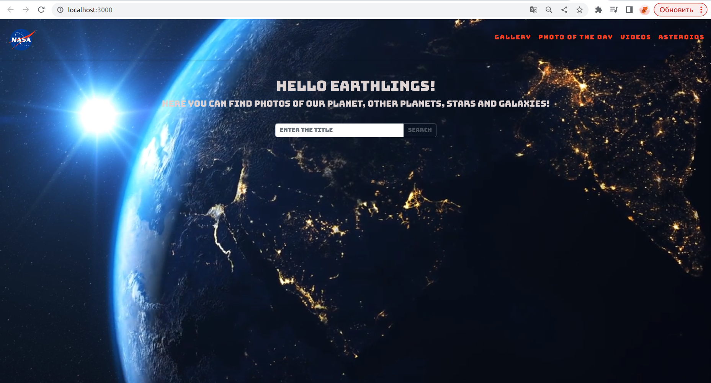
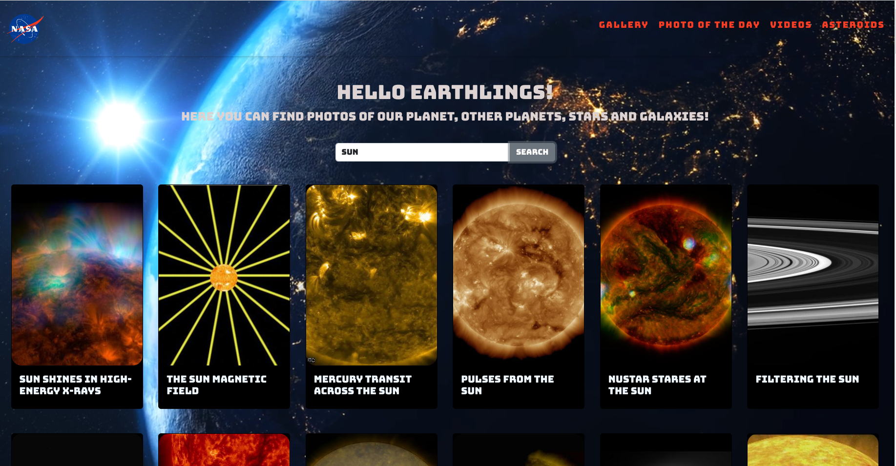
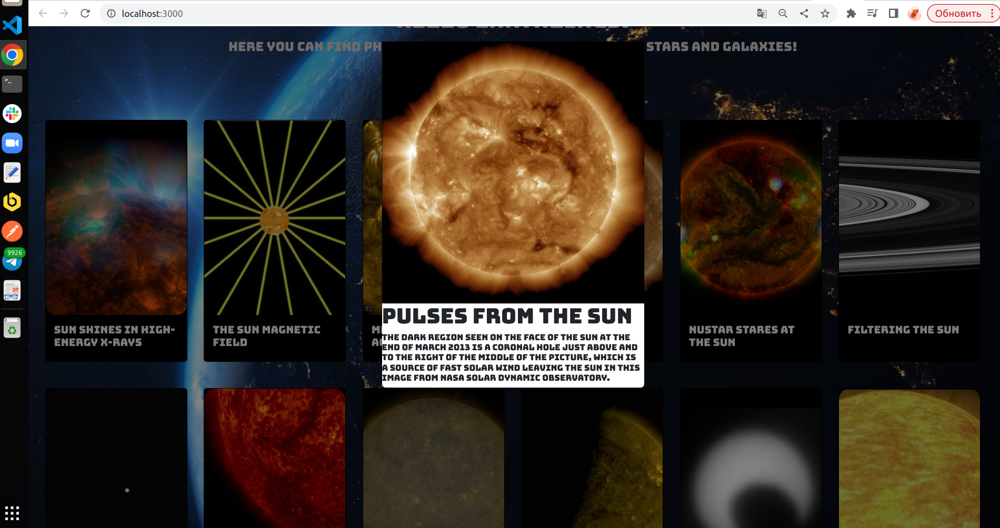
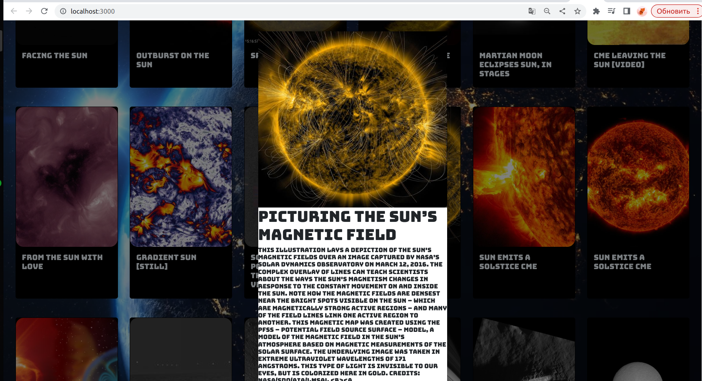
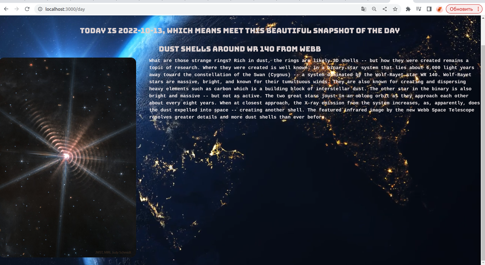
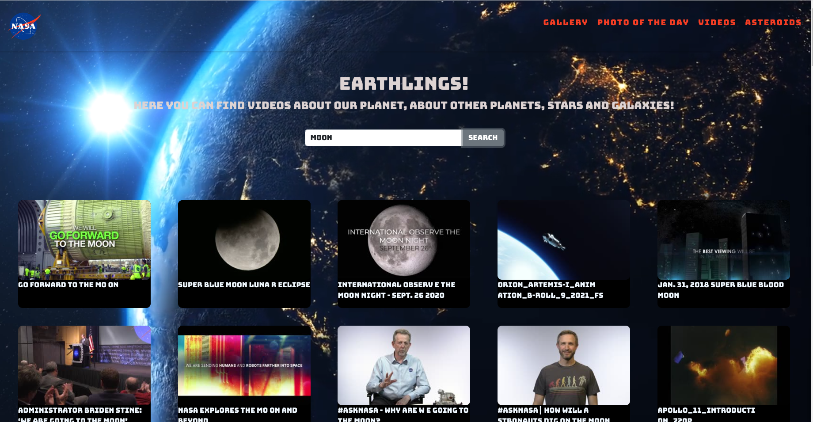
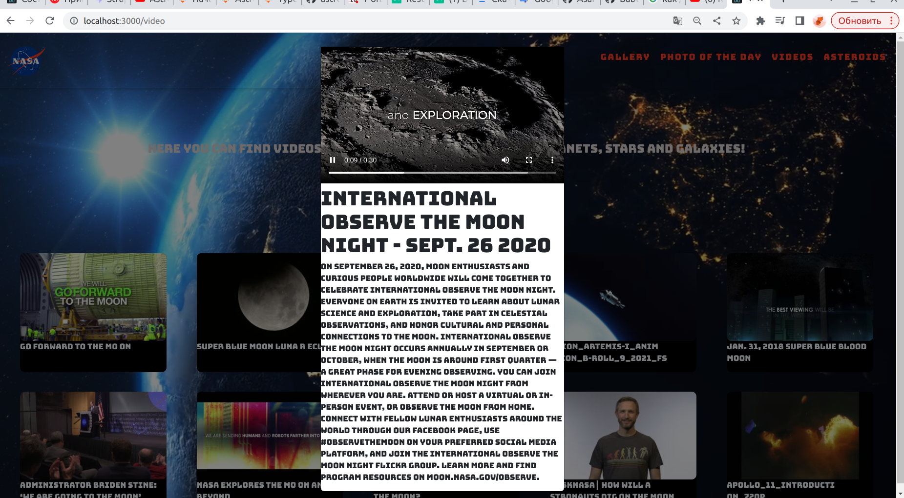
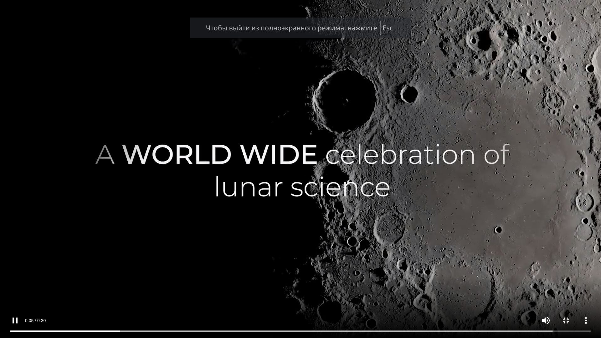
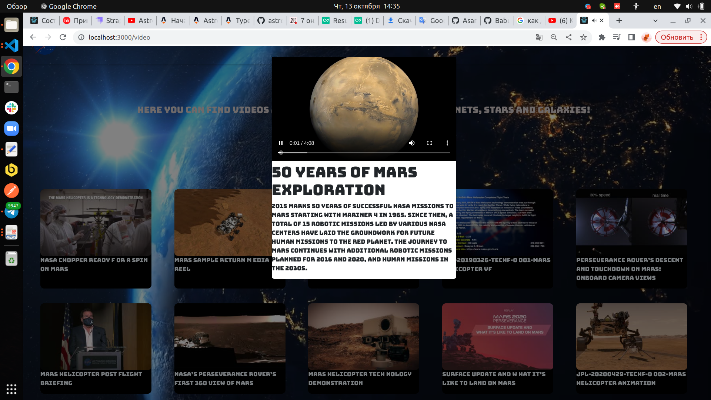
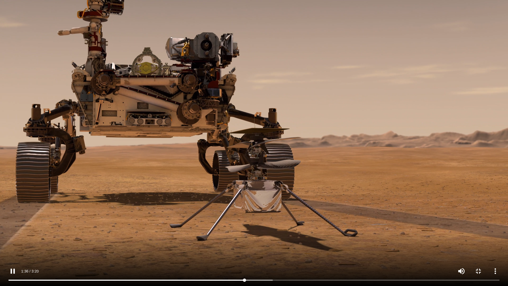

# SPACE TRAVEL

## Стильное SPA-приложение с использованием

## NASA API , позволяющее окунуться в

## космическую одиссею , и с наслаждением

## наблюдать за небесными телами и

## объектами

---

### Вводим в поисковик в разделе галереи нужную цель , и получаем в ответ снимки с небольшим описанием
 
  

---

### Переходим в раздел фото дня

---

### Переходим в раздел видео,вводим в поисковик нужную цель , и получаем в видеоролики с небольшим описанием

#### например Луну

#### или Марс

---
## Проект все еще на стадии разработки
### Планируется внедрить интерактив с Астероидами, улучшить дизайн карточек 

###### REACT / REACT-VIDEO / REACT-BOOTSTRAP / Axios / Fetch
